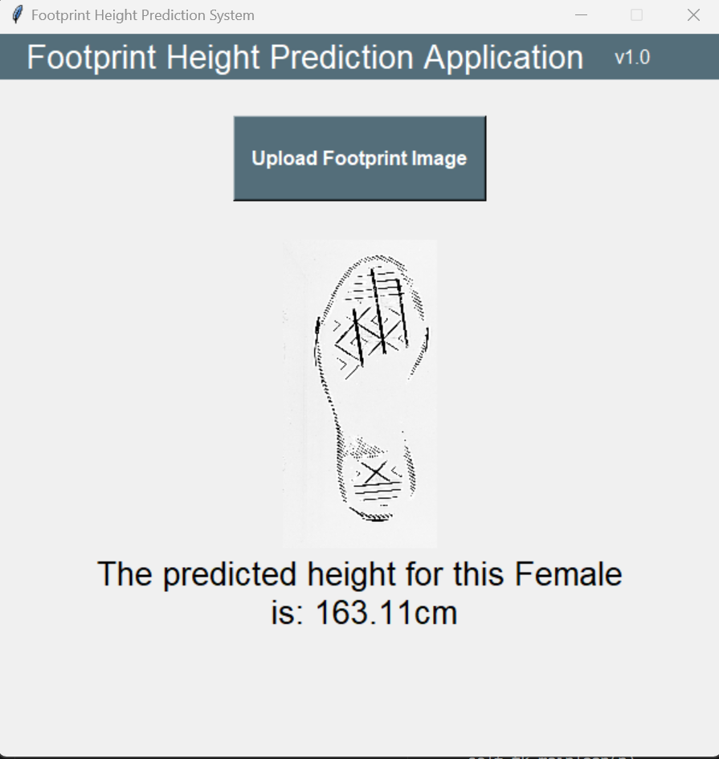

# Foot Height Predictor

This project predicts the height of a foot from an image using a combination of Convolutional Neural Network (CNN) and Support Vector Machine (SVM) models.

## Requirements

- Python 3.x
- TensorFlow
- NumPy
- Pillow
- Joblib
- Tkinter

You can install the required packages using the following command:

```sh
pip install -r requirements.txt

## Usage

1. Run the Inference Script:
    ```bash
    python main.py
    ```
2. Follow the on-screen instructions to input foot size and get the predicted height.


## Functions
* Loads the CNN model and SVM model.
* Processes the input image.
* Predicts intermediate values using the CNN model.
* Uses the SVM model to predict coefficients.
* Uses the DNN model to predict the height.

## GUI

Here is an example of the GUI:




## Contributing
Contributions are welcome! Please open an issue or submit a pull request for any changes.
